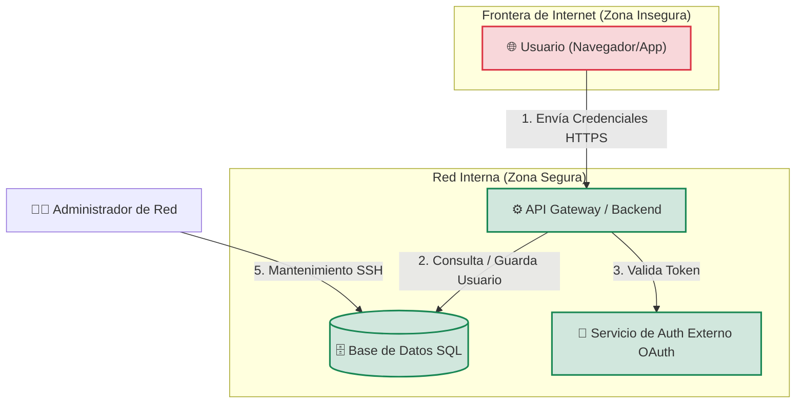

# Diagrama

```mermaid
graph TD
    %% Definición de Estilos y Fronteras de Confianza
    classDef internet fill:#F8D7DA,stroke:#DC3545,stroke-width:2px;
    classDef secureZone fill:#D1E7DD,stroke:#198754,stroke-width:2px;

    %% Actores y Componentes
    Usuario["🌐 Usuario (Navegador/App)"] -->|1. Envía Credenciales HTTPS| API["⚙️ API Gateway / Backend"]
    Admin["👨‍💻 Administrador de Red"] -->|5. Mantenimiento SSH| BD[("🗄️ Base de Datos SQL")]

    API -->|2. Consulta / Guarda Usuario| BD
    API -->|3. Valida Token| Auth["🔑 Servicio de Auth Externo OAuth"]

    %% Fronteras de Confianza
    subgraph SG1["Frontera de Internet (Zona Insegura)"]
        Usuario
    end

    subgraph SG2["Red Interna (Zona Segura)"]
        API
        BD
        Auth
    end

    %% Aplicar Estilos
    class Usuario internet;
    class API,BD,Auth secureZone;
```
