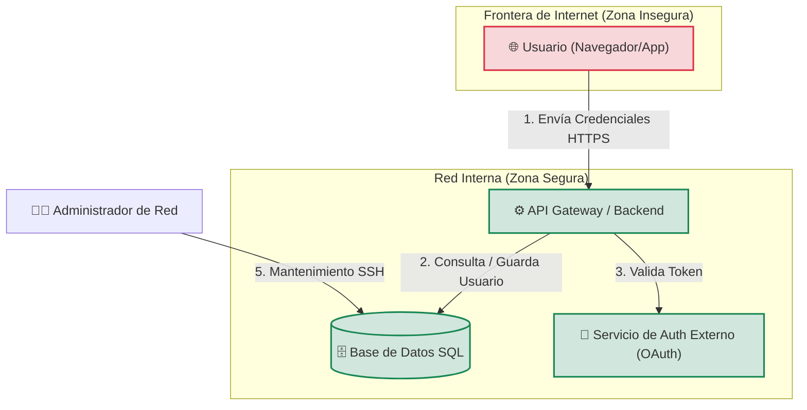

# Modelado de Amenazas: Sistema de Autenticación y API de Usuarios

**Fecha:** 2026-09-02  
**Versión:** 1.0  
**Autores:** [María Fernanda Madrid Cháidez / 4B]

## 1. Diagrama de Flujo de Datos (DFD) con Mermaid.js

A continuación se muestra la arquitectura lógica del sistema, los flujos de datos y las fronteras de confianza (Trust Boundaries) que separan las zonas seguras de las inseguras.

## 2. Matriz de Amenazas (Metodología STRIDE)

Para analizar los riesgos en las fronteras de confianza, aplicamos el modelo STRIDE (Spoofing, Tampering, Repudiation, Information Disclosure, Denial of Service, Elevation of Privilege).

| ID | Componente / Flujo afectado | Amenaza (STRIDE) | Descripción del Riesgo | Mitigación Propuesta | Estado |
|---|---|---|---|---|---|
| **T-01** | Flujo 1 (Usuario → API) | **Spoofing (Suplantación)** | Un atacante obtiene o utiliza credenciales robadas para hacerse pasar por un usuario legítimo. | HTTPS obligatorio con TLS 1.3, cookies seguras (`HttpOnly`, `Secure`), expiración de sesiones y MFA cuando sea posible. | 🟢 Mitigado |
| **T-02** | Flujo 2 (API → BD) | **Tampering (Alteración)** | Un atacante introduce código SQL malicioso mediante los campos de entrada para modificar o manipular consultas. | Uso de consultas preparadas, parámetros, ORM seguro y validación de entradas. | 🟢 Mitigado |
| **T-03** | Componente: Base de Datos | **Information Disclosure** | Un acceso no autorizado a la base de datos podría exponer información sensible de los usuarios. | Almacenar contraseñas mediante hashing con Argon2id o bcrypt. Utilizar cifrado de datos en reposo y controles de acceso. | 🟢 Mitigado |
| **T-04** | Flujo 1 (Usuario → API) | **Denial of Service** | Un atacante puede enviar grandes cantidades de peticiones de login para saturar la API. | Implementar un Rate Limiter en el API Gateway, por ejemplo, máximo 5 intentos de login por minuto por IP. | 🟡 En Progreso |
| **T-05** | Flujo 5 (Admin → BD) | **Elevation of Privilege** | Un atacante podría intentar acceder al servicio SSH mediante ataques de fuerza bruta para obtener privilegios administrativos. | Restringir SSH y evitar acceso desde Internet (`0.0.0.0/0`). Permitir únicamente VPN o Bastion Host y utilizar claves SSH. | ❌ Pendiente |

## 3. Lista de Control de Mitigaciones Pendientes (Checklist)

A medida que el equipo de desarrollo escribe el código y configura la red, debe marcar el progreso aquí:

- [x] Configurar TLS 1.3 en el servidor web.
- [x] Implementar hashing de contraseñas con Argon2id.
- [ ] Implementar Rate Limiting en la API.
- [ ] Configurar las reglas de Firewall (Security Groups) para aislar la Base de Datos.
- [ ] Restringir el acceso SSH mediante VPN o Bastion Host.
- [ ] Implementar autenticación multifactor (MFA).